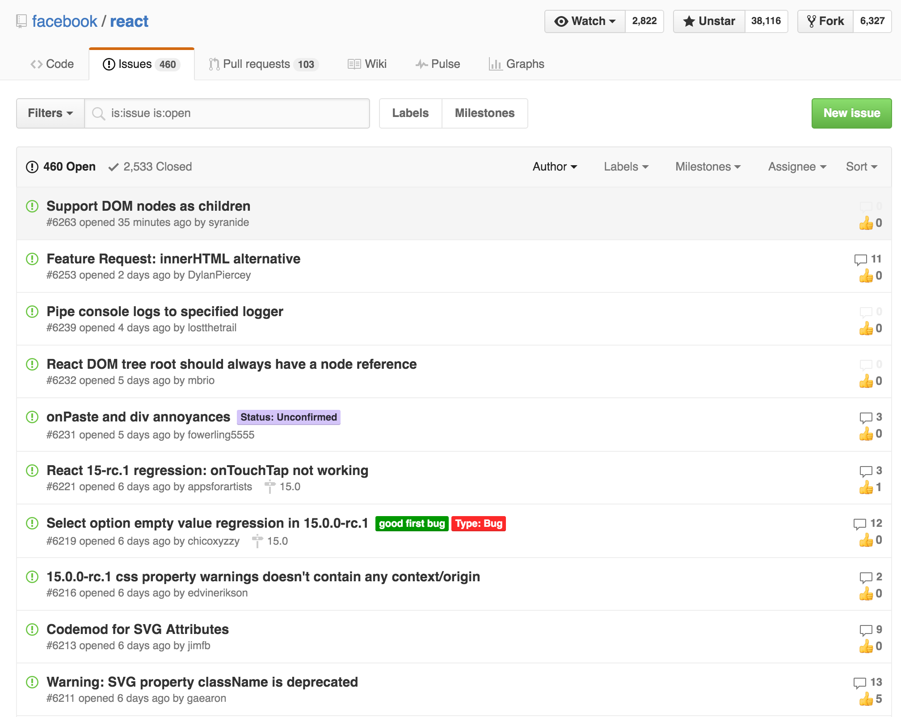
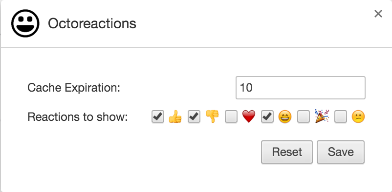

<!---->

# octoreactions
Chrome plugin to display Github Issue Reactions

Displays the counts of reactions next to the header of a Issue Detail View and the counts in each row of the Issue List View.

# What does it look like?

## Detail View

## List View

# Options View
